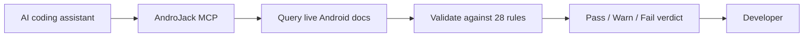
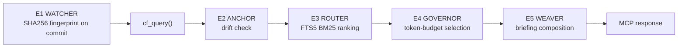
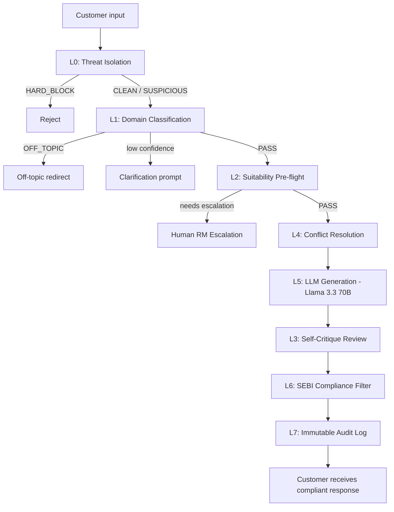

# Vikas Sahani

**Virtual Relationship Manager @ Aditya Birla Capital · Targeting APM roles in AI Products & Developer Tooling**

4.5+ years in regulated banking (ICICI, IndusInd, HDFC, Aditya Birla Capital) building trust with HNI clients and managing ₹150Cr+ AUM. Parallel track: directing AI coding agents to ship real products with real distribution — I own the problem framing, the prioritization, and the validation bar; AI executes.

  

---

## At a Glance

| Project | Status | Verified Highlight |
|---|---|---|
| [AndroJack MCP](https://github.com/VIKAS9793/AndroJack-mcp) | Live · v2.0.0 | 660 launch-window clones, 251 unique cloners, 0 known vulnerabilities |
| [Context Fabric](https://github.com/VIKAS9793/context-fabric) | Live · v1.2.2 | Real npm distribution, live analytics dashboard *(figure below pending final check — see note)* |
| [Pramiti OS](https://github.com/VIKAS9793/pramiti-os) | Beta / PoC | Human-verification gate as core design constraint |
| [Dharitri](https://github.com/VIKAS9793/dharitri-agri-ai) | Pre-launch / Active Dev | 291 Kotlin files, 14 architecture docs, on-device Gemma 4 |
| [VouchList](https://github.com/VIKAS9793/vouchlist) | Phase 0 | Real CI, WCAG 2.2 AA accessibility gates |
| [Fintech Onboarding Clarity](https://github.com/VIKAS9793/Fintech-Onboarding-Clarity) | Case Study | Constraint-first UX discovery, Figma prototype |
| [NorthStar Wealth Companion](https://github.com/VIKAS9793/northstar-wealth-ai) | Hackathon PoC | 158/158 tests passing, 7-layer governance pipeline |

---

## How These Get Built

I'm not an engineer, and I'm currently building basic technical literacy (reading API/JSON responses, basic SQL) specifically to work more effectively with engineering teams — not claiming that skill yet. What I do own on every project below: I direct all architecture, product, and security decisions; I review and edit everything AI generates before it ships; I write the PRDs, GTM plans, and requirements myself. The codebase isn't hand-typed by me line by line, but it isn't generated without review either — it's AI-assisted execution under continuous human direction, and the product judgment is mine.

---

## Projects

### [AndroJack MCP](https://github.com/VIKAS9793/AndroJack-mcp)

  

**v2.0.0 · 23 MCP tools · npm + VS Code Marketplace + MCP Registry · 0 known vulnerabilities in the shipped dependency tree**

AI coding assistants generate Android code from stale training data — wrong APIs, deprecated patterns, Play Store rejections. I scoped the fix as a validation gate, not a patch: AndroJack intercepts the generation loop, forces a live-documentation query before output, then validates every code block against 28 rules before it reaches the developer.

- Remediated 7 dependency vulnerabilities (3 high) to zero, validated against the full test suite before shipping
- Compatible with Claude Desktop, Cursor, Windsurf, Kiro, VS Code, Antigravity IDE
- Instrumented a GA4 behavioral funnel (discovery → evaluation → activation) to validate the launch, not just ship and hope: 660 GitHub clones from 251 unique cloners in the first 14 days — cloners exceeding visitors confirmed organic terminal-first (`npx`) adoption, with Reddit as the primary channel (74 referrals)
- Full PRD, JTBD, personas, roadmap, and GTM strategy live in [`product-management/README.md`](https://github.com/VIKAS9793/AndroJack-mcp/tree/main/product-management) — the product thinking behind the tool, not just the tool

```mermaid
flowchart LR
    A["AI coding assistant"] --> B["AndroJack MCP"]
    B --> C["Query live Android docs"]
    C --> D["Validate against 28 rules"]
    D --> E["Pass / Warn / Fail verdict"]
    E --> F["Developer"]
```

`npx androjack-mcp install` · `TypeScript 5.5` · `Node.js ≥18` · `MCP Protocol`

---

### [Context Fabric](https://github.com/VIKAS9793/context-fabric)

  

**v1.2.2 · officially listed in the MCP Registry** *(live npm download count shown in the badge above — not restated here as a static number, since it changes daily and a hardcoded figure would go stale immediately)*

AI coding agents lose project context between sessions — developers manually rebuild it every time. I designed a five-engine architecture (WATCHER, ANCHOR, ROUTER, GOVERNOR, WEAVER) to capture project state automatically on every commit and deliver token-budgeted briefings without developer effort, and shipped a public analytics dashboard so adoption is measured, not asserted.

```mermaid
flowchart LR
    W["E1 WATCHER<br/>SHA256 fingerprint on commit"] --> Q["cf_query()"]
    Q --> A["E2 ANCHOR<br/>drift check"]
    A --> R["E3 ROUTER<br/>FTS5 BM25 ranking"]
    R --> G["E4 GOVERNOR<br/>token-budget selection"]
    G --> WV["E5 WEAVER<br/>briefing composition"]
    WV --> M["MCP response"]
```

`TypeScript 5.5+` · `Node.js ≥22` · `MCP SDK 1.29.0`

---

### [Pramiti OS](https://github.com/VIKAS9793/pramiti-os) *(Beta — Proof of Concept)*

**प्रमिति (Pramiti), Sanskrit: valid, justified knowledge — as distinct from guesswork.**

As an RM, I live the problem this solves: client data fragmented across CRM, core banking, and market terminals, and a real regulatory risk (DPDP Act, RBI human-in-the-loop rules) if an AI wrapper skips verification to move faster. I specified the human-confirmation gate on every material action as the actual product requirement — not a compliance afterthought — then prototyped it fast enough to test whether RMs would trust it.

`Next.js 16` · `React 19` · `LangGraph` · `FastAPI` · `MCP`

---

### [VouchList](https://github.com/VIKAS9793/vouchlist) *(Phase 0 — Demand Validation)*

 

A PM case study and honest demand-validation exercise, not a finished product — the live site is a smoke-test landing page measuring real interest (visits, waitlist signups, geography) *before* committing to build the WhatsApp bot itself. No bot exists yet; that's by design, not a gap.

- Problem: trusted local recommendations in dense Mumbai residential WhatsApp groups get buried and become unsearchable within days
- I wrote the PRD, GTM plan, and north-star metric definition (Resolved Asks, not engagement volume) myself
- Real CI: lint, unit test coverage, and production build gated on every push; separately enforced pre-release gates for accessibility (WCAG 2.2 AA), security headers, dependency vulnerabilities, and spam/rate-limiting

`TanStack Start` · `React 19` · `TypeScript` · `Supabase`

---

### [Fintech Onboarding Clarity](https://github.com/VIKAS9793/Fintech-Onboarding-Clarity) *(Exploratory PM Case Study)*

An honest exploration, not a company critique: reducing user uncertainty during regulated fintech KYC onboarding, with an explicit statement that AI never approves, rejects, or overrides a verification decision — that authority stays human.

- Constraint-first discovery: constraints documented before solutions, assumptions separated from unknowns, AI decision boundaries defined up front
- My role stated directly in the repo: Product Manager — discovery, UX direction, low-to-mid fidelity Figma mockups
- Includes a video pitch, an interactive Figma prototype, and a "Lessons Learned" section naming what I'd still need to validate before treating this as buildable

---

### [NorthStar Wealth Companion](https://github.com/VIKAS9793/northstar-wealth-ai) *(Hackathon PoC — IDBI Innovate 2026)*

 

Built from a pattern I saw repeatedly in RM conversations: investors rarely ask about asset allocation or expense ratios — they ask "should I stop my SIP," "why isn't my portfolio growing." Designed to augment RMs, not replace them: it escalates to a human immediately for complex or emotionally charged queries.

- I specified the 7-layer deterministic governance pipeline myself — threat isolation, domain classification, suitability pre-flight checks, human-RM escalation, LLM generation (Llama 3.3 70B via Groq), self-critique, SEBI-compliance filtering, immutable audit trail — no response reaches a customer without passing every active layer
- Built and validated: 158 tests across 6 suites passing, enforced by branch protection before anything merges to main
- Financial concepts explained through analogies (compounding as a mango tree, SIP cost-averaging as sale season) — the same plain-language approach I use with clients daily, encoded into the product

```mermaid
graph TD
    A["Customer input"] --> L0["L0: Threat Isolation"]
    L0 -->|HARD_BLOCK| BLOCK["Reject"]
    L0 -->|CLEAN / SUSPICIOUS| L1["L1: Domain Classification"]
    L1 -->|OFF_TOPIC| OT["Off-topic redirect"]
    L1 -->|"low confidence"| PROBE["Clarification prompt"]
    L1 -->|PASS| L2["L2: Suitability Pre-flight"]
    L2 -->|"needs escalation"| RM["Human RM Escalation"]
    L2 -->|PASS| L4["L4: Conflict Resolution"]
    L4 --> L5["L5: LLM Generation - Llama 3.3 70B"]
    L5 --> L3["L3: Self-Critique Review"]
    L3 --> L6["L6: SEBI Compliance Filter"]
    L6 --> L7["L7: Immutable Audit Log"]
    L7 --> OUT["Customer receives compliant response"]
```

`Next.js 16` · `React 19` · `Groq LPU (Llama 3.3 70B)` · `Vitest`

---

## By the Numbers

*(Every figure here is stated elsewhere in this document, sourced from a live repo, badge, or test suite — nothing new introduced here.)*

**6** shipped or in-progress products · **2** with live npm/Marketplace distribution · **1,794** lifetime npm downloads (Context Fabric) · **23** MCP tools (AndroJack) · **158/158** tests passing (NorthStar) · **4** completed certifications

---

## Credentials

*(Names and skill tags below are pulled exactly from my portfolio site's data source — the authoritative source for this section.)*

| Certification | Issuer |
|---|---|
| **IBM Product Manager Professional Certificate** | IBM, via Coursera |
| **Google AI Professional Certificate** | Google, via Coursera |
| **Google Project Management Professional Certificate** | Google, via Coursera |
| **Design Thinking and Innovation** | IIT Bombay, via Coursera |

*(NISM V-A: Mutual Fund Distributor Certification (valid until Oct 2027) and IRDAI Corporate Agent (Composite) Certification (valid until Feb 2028) also held.)*

---

## Skills — Certification-Verified, Mapped to Proof of Work

Only skills actually attached to a completed certification, and only where I can point to where each one got used.

**From IBM Product Manager Professional Certificate:** Product Strategy, Product Management Lifecycle, Sprint Planning, Stakeholder Management, Value Proposition
→ Applied in the full PRD, roadmap, and GTM strategy inside [AndroJack MCP](https://github.com/VIKAS9793/AndroJack-mcp/tree/main/product-management)

**From Design Thinking and Innovation (IIT Bombay):** User Research & Empathy, Ideation & Brainstorming, Rapid Prototyping, User Feedback & Iteration, User-Centered Design
→ Applied in [Fintech Onboarding Clarity](https://github.com/VIKAS9793/Fintech-Onboarding-Clarity)'s constraint-first discovery process and [Pramiti OS](https://github.com/VIKAS9793/pramiti-os)'s rapid-prototype-to-test-trust approach

**From Google Project Management Professional Certificate:** Agile Project Management, Project Management
→ Applied in [VouchList](https://github.com/VIKAS9793/vouchlist)'s phased approach — Phase 0 demand validation before any build commitment

**From Google AI Professional Certificate:** Prompt Engineering, Responsible AI, AI Acumen
→ Applied in directing and validating AI-agent output across every project above — deciding what "done" means and reviewing every generated result before it ships

---

Mumbai, India · Open to relocation · Global remote
