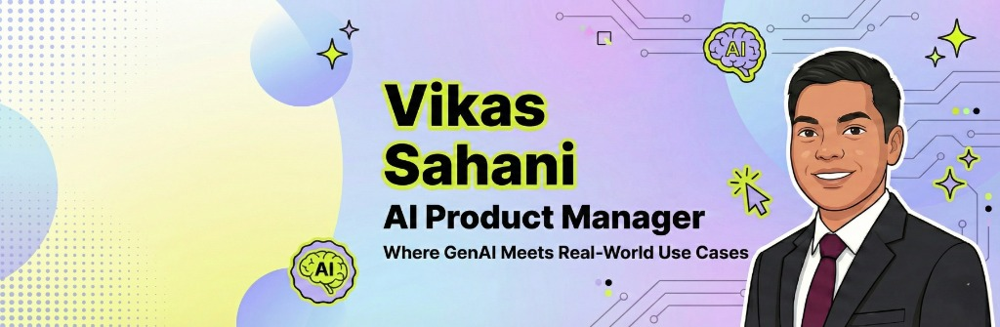
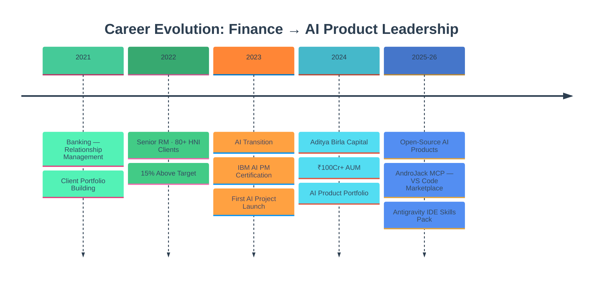

# 👋 Hi there, I'm Vikas Sahani

<picture>
  <source media="(prefers-color-scheme: dark)" srcset="assets/images/profile_banner.jpg">
  <source media="(prefers-color-scheme: light)" srcset="assets/images/profile_banner.jpg">
  
</picture>

<table>
<tr>
<td width="35%" align="center">

  

</td>
<td width="65%" align="left">

<h3><b>Vikas Sahani</b></h3>
<h4>🎯 Associate Product Manager · AI Products &amp; Developer Tooling</h4>

<b>💼 Current Role:</b> Virtual Relationship Manager @ Aditya Birla Capital 
<b>🏆 Latest:</b> AndroJack MCP — 530+ downloads in first week after launch 
<b>🎓 Background:</b> 4+ years regulated banking → AI Product Leadership 
<b>📍 Location:</b> Mumbai, India &nbsp;|&nbsp; Open to Relocation · Global Remote

<i>Builder of trustworthy AI systems and developer platforms. Product-focused professional transitioning from regulated finance into AI product management — bridging business credibility with hands-on technical execution.</i>

</td>
</tr>
</table>

> [!TIP]
> **Targeting Associate Product Manager — AI Products & Developer Tooling.** Open to relocation and global remote. [View Portfolio](https://myportfoliohubexpo.netlify.app) | [Connect on LinkedIn](https://linkedin.com/in/vikas-sahani-727420358)

---

## 🚀 Featured AI Product Portfolio

### 🤖 [AndroJack MCP](https://github.com/VIKAS9793/AndroJack-mcp) — *Latest Project*

**Documentation-Grounded Android Engineering Agent** — an MCP server that intercepts AI code generation and forces it to query live official Android documentation before producing output, then validates every code block against 22 rules before returning it to the developer.

| | |
|---|---|
| **🎯 Problem Solved** | AI coding assistants generate Android code from stale training data — wrong APIs, wrong versions, Play Store rejections |
| **🏗️ Architecture** | Level 3 loop-back validation: doc-fetch gate → code generation → 22-rule validator → PASS/WARN/FAIL verdict |
| **🔧 Tools** | 21 MCP tools covering Navigation 3, Material 3 Expressive, API 36 compliance, KMP, XR, Wear OS, on-device AI |
| **📦 Distribution** | `npx androjack-mcp install` · VS Code Marketplace · Antigravity IDE Skills |
| **📈 Traction** | **530+ downloads in first week** · 6 rapid updates shipped within 48 hours of launch |
| **🎯 GTM** | Developer ecosystem research → IDE plugin + GitHub as primary acquisition channels |
| **🌍 Compatible With** | Claude Desktop · Cursor · Windsurf · Kiro · Antigravity IDE |

---

### 🏆 Product Titans — National Product Management Challenge · **Rank 2**

*Hosted on Unstop | Organized by Book My Mentor*

Ranked 2nd nationally in a product strategy competition. Delivered a full product roadmap and growth strategy using JTBD analysis, user segmentation, and RICE prioritisation — presented to industry mentors and evaluators.

---

### [🌾 KrishiSahayak+Gemma](https://github.com/VIKAS9793/KrishiSahayak_Gemma)

**Offline Agricultural AI Assistant**

AI-powered crop disease advisory for 150M+ Indian farmers on 2GB RAM devices with no internet. 100% offline RAG, multilingual voice TTS, 4-bit quantized Gemma-3n E2B, compressed FAISS index, SQLite knowledge base.

---

### [🎤 AI Interview Simulator](https://github.com/VIKAS9793/ai-interviewer-langchain)

**Multi-Agent Technical Interview Platform**

6 specialist sub-agents, adaptive questioning, live code analysis. Built on Google ADK + A2A-ADK Bridge with Cloud Run deployment and session persistence.

---

### [🎨 CharacterCraft Pro](https://github.com/VIKAS9793/charactercraft-pro)

**AI Character Consistency Platform**

Deterministic "Prompt Protocol Engine" for reproducible character consistency across AI-generated imagery. Multi-model fusion with version control for creative professionals.

---

### [🎓 EduVault](https://github.com/VIKAS9793/EduVault)

**Offline-First Educational Platform**

Voice-first education for 150M+ rural students. 100% offline PWA, Hindi/English support, WCAG 2.1 AA compliant, <200MB footprint.

---

## 💼 Professional Journey

```mermaid
%%{init: {'theme':'base', 'themeVariables': {'primaryColor':'#A8E6CF','secondaryColor':'#88D8B0','tertiaryColor':'#FFD3B6','primaryTextColor':'#2C3E50','secondaryTextColor':'#2C3E50','lineColor':'#5DADE2'}}}%%
timeline
    title Career Evolution: Finance → AI Product Leadership
    2021 : Banking — Relationship Management
         : Client Portfolio Building
    2022 : Senior RM · 80+ HNI Clients
         : 15% Above Target
    2023 : AI Transition
         : IBM AI PM Certification
         : First AI Project Launch
    2024 : Aditya Birla Capital
         : ₹100Cr+ AUM
         : AI Product Portfolio
    2025-26 : Open-Source AI Products
            : AndroJack MCP — VS Code Marketplace
            : Antigravity IDE Skills Pack
```

---

## 🛠️ Technical Stack

  

<table>
<tr>
<th width="20%">Category</th>
<th width="55%">Technologies</th>
<th width="25%">Proficiency</th>
</tr>
<tr>
<td align="center"><b>🤖 AI/ML</b></td>
<td>

</td>
<td align="center"></td>
</tr>
<tr>
<td align="center"><b>📊 Product</b></td>
<td>

</td>
<td align="center"></td>
</tr>
<tr>
<td align="center"><b>☁️ Cloud</b></td>
<td>

</td>
<td align="center"></td>
</tr>
<tr>
<td align="center"><b>🔧 Backend</b></td>
<td>

</td>
<td align="center"></td>
</tr>
<tr>
<td align="center"><b>🗄️ Data</b></td>
<td>

</td>
<td align="center"></td>
</tr>
</table>

---

## 🏅 Certifications

| Certification | Issuer | Date | Verification |
|:--------------|:-------|:-----|:-------------|
| **5-Day AI Agents Intensive** | Kaggle / Google | Dec 2025 | [Verify](https://www.kaggle.com/vikassahani9793) |
| **Generative AI Leader (5 Courses)** | Google Cloud / Coursera | Dec 2025 | [Verify](https://coursera.org/verify/professional-cert/NVDRXRBUXENW) |
| **Google People Management Essentials** | Google / Coursera | Dec 2025 | [Verify](https://www.credly.com/users/vikas-sahani.e0a347d7/badges) |
| **Intro to GenAI for Software Development** | DeepLearning.AI | Dec 2025 | [Verify](https://coursera.org/verify/M9YFNIZLO9IP) |
| **IBM AI Product Manager (7 Courses)** | IBM / Coursera | Oct 2025 | [Verify](https://coursera.org/verify/professional-cert/OX1B2FKYEOYQ) |
| **Principles of UX/UI Design** | Meta / Coursera | Oct 2025 | [Verify](https://www.credly.com/users/vikas-sahani.e0a347d7/badges) |
| **Google Project Management (7 Courses)** | Google / Coursera | Aug 2025 | [Verify](https://coursera.org/verify/professional-cert/6QP622NTFAXB) |
| **GenAI Software Engineering (4 Courses)** | Vanderbilt / Coursera | Aug 2025 | [Verify](https://coursera.org/verify/specialization/CPF085M9073W) |
| **Google AI Essentials (5 Courses)** | Google / Coursera | Aug 2025 | [Verify](https://coursera.org/verify/specialization/5BLLP6FX4KSL) |
| **Machine Learning** | O.P. Jindal / Coursera | Aug 2025 | [Verify](https://coursera.org/verify/5RGUOWDEE1EQ) |

---

## 📊 GitHub Analytics

---

## 📱 Connect

<table>
<tr>
<td align="center" width="20%">
<a href="https://linkedin.com/in/vikas-sahani-727420358">
 
<b>Professional Network</b>
</a>
</td>
<td align="center" width="20%">
<a href="https://myportfoliohubexpo.netlify.app">
 
<b>Live Projects</b>
</a>
</td>
<td align="center" width="20%">
<a href="https://androjack-web.netlify.app/">
 
<b>Latest Project</b>
</a>
</td>
<td align="center" width="20%">
<a href="mailto:vikassahani17@gmail.com">
 
<b>Direct Contact</b>
</a>
</td>
<td align="center" width="20%">
<a href="https://www.credly.com/users/vikas-sahani.e0a347d7/badges">
 
<b>Certifications</b>
</a>
</td>
</tr>
</table>

---

### 💡 "Product Strategy + Technical Execution = Scalable AI Solutions"

Last Updated: March 2026 | Open Source on <a href="https://github.com/VIKAS9793">GitHub</a> | MIT Licensed

