# 👋 Hi there, I'm Vikas Sahani

<!-- PROPERLY FIXED: Using AI/Product Manager themed animation from verified GitHub source -->
<!-- This matches the professional tech/AI product management role -->

<!-- Glassmorphic Profile Card -->
<!-- FIXED: Converted Markdown headers to HTML inside table cells for consistent rendering -->
<table>
<tr>
<td width="35%" align="center">

  

</td>
<td width="65%" align="left">

<h3><b>Vikas Sahani</b></h3>
<h4>🎯 AI Product Manager | 🏗️ ML Systems Architect</h4>

<b>💼 Current Role:</b> Virtual Relationship Manager @ Aditya Birla Capital 
<b>💰 Portfolio:</b> ₹100 Crores+ Assets Under Management 
<b>📠Education:</b> BSc Botany → Finance → AI Product Leadership 
<b>📠Location:</b> Mumbai, Maharashtra, India

<b>🅠Certifications:</b> 
• IBM AI Product Manager Professional (2025) 
• Google Project Management Professional (2025) 
• DeepLearning.AI - AI Agents in LangGraph (2025)

<b>🯠Mission:</b> 
<i>Building accessible AI products for underserved markets with measurable business impact</i>

</td>
</tr>
</table>

<!-- Real-time Stats Dashboard -->

<!-- Animated Typing SVG -->

---

## 🚀 Professional Snapshot

<table>
<tr>
<td width="25%" align="center">

**🎯 Product Strategy**

End-to-end AI/ML product development from ideation to GTM execution

**95%** Product-Market Fit Score

</td>
<td width="25%" align="center">

**🏗️ Technical Depth**

Production-ready architectures with LangChain, RAG, and foundation models

**90%** Code Coverage Standard

</td>
<td width="25%" align="center">

**📊 Business Impact**

₹100Cr+ AUM | 10% diversification boost via AI analytics

**15%** YoY Growth

</td>
<td width="25%" align="center">

**🌍 Social Mission**

Offline-first AI for underserved communities and rural markets

**$12B** TAM Addressed

</td>
</tr>
</table>

---

## 🏆 Featured AI Product Portfolio

<!-- Project Showcase with Metrics -->
<table>
<tr>
<td width="50%" valign="top">

### [🎨 CharacterCraft Pro](https://github.com/VIKAS9793/charactercraft-pro)

**AI-Powered Character Consistency Platform**

**🎯 Product Vision:** Solving critical character consistency in AI-generated imagery  
**💡 Innovation:** Deterministic "Prompt Protocol Engine" for reproducible outputs  
**📊 Market Stage:** Validation phase with creative professionals  
**🔧 Features:** Multi-model fusion, progressive enhancement, version control

</td>
<td width="50%" valign="top">

### [📊 MoatMetrics](https://github.com/VIKAS9793/moatmetrics)

**Privacy-First MSP Analytics Platform**

**🎯 Business Impact:** $12B serviceable addressable market (SAM)  
**⚙️ Tech Stack:** Python, FastAPI, Pandas, SQLAlchemy, TimescaleDB  
**📈 GTM Strategy:** Product-led growth with freemium model  
**💰 Projections:** $1M ARR target in Year 1

</td>
</tr>
<tr>
<td width="50%" valign="top">

### [🌾 KrishiSahayak+Gemma](https://github.com/VIKAS9793/KrishiSahayak_Gemma)

**Offline Agricultural AI Assistant**

**🌾 Mission:** AI-powered advisory for Indian farmers in low-connectivity regions  
**📱 Innovation:** 100% offline operation with local RAG and P2P knowledge sharing  
**🎯 Target Market:** 150M+ rural farmers with limited internet access  
**🔧 Architecture:** On-device inference, local vector DB, mesh networking

</td>
<td width="50%" valign="top">

### [🎤 AI Interview Simulator](https://github.com/VIKAS9793/ai-interviewer-langchain)

**Enterprise Interview Preparation Platform**

**🎯 Achievement:** 3-month enterprise pilot secured  
**🔒 Architecture:** Privacy-first with LangGraph state management, local LLaMA inference  
**💼 Success Metrics:** 85% user satisfaction, 40% improvement in interview performance  
**🏢 Enterprise Features:** Role-specific scenarios, performance analytics, API integration

</td>
</tr>
</table>

<!-- Live Project Metrics -->

---

## 💼 Professional Journey

<!-- FIXED: Changed Mermaid theme from 'dark' to 'base' for better compatibility across GitHub light/dark modes -->

<table>
<tr>
<td width="50%" align="center">

**🏢 Current: Aditya Birla Capital**  
*Virtual Relationship Manager*  
**2024 - Present**

📊 **Key Achievements:**
- Manage ₹100 crores+ diversified portfolio
- 10% increase in diversification via AI analytics
- 25% efficiency boost through AI tool integration
- Built internal AI-powered client insights dashboard

</td>
<td width="50%" align="center">

**🏦 Previous: Banking Sector**  
*Senior Relationship Manager*  
**2021 - 2024**

📈 **Key Achievements:**
- 80+ HNI client portfolio management
- 15% exceed acquisition goals (3 consecutive quarters)
- 20% YoY AUM growth through strategic advisory
- Pioneered data-driven client segmentation

</td>
</tr>
</table>

---

## 🛠️ Technical Arsenal

<!-- PROPERLY FIXED: Using tech stack/development themed animation from verified GitHub source -->
<!-- This complements the AI Product Manager + Technical Builder role -->

### **Core Technology Stack**

  

<!-- Proficiency Matrix -->
<!-- FIXED: Standardized all badge styles to 'flat-square' for consistency -->
<table>
<tr>
<th width="25%">Category</th>
<th width="50%">Technologies</th>
<th width="25%">Proficiency</th>
</tr>
<tr>
<td align="center"><b>🤖 AI/ML</b></td>
<td>

</td>
<td align="center">

</td>
</tr>
<tr>
<td align="center"><b>📊 Product</b></td>
<td>

</td>
<td align="center">

</td>
</tr>
<tr>
<td align="center"><b>☁️ Cloud</b></td>
<td>

</td>
<td align="center">

</td>
</tr>
<tr>
<td align="center"><b>🔧 Backend</b></td>
<td>

</td>
<td align="center">

</td>
</tr>
<tr>
<td align="center"><b>📱 Frontend</b></td>
<td>

</td>
<td align="center">

</td>
</tr>
<tr>
<td align="center"><b>🗄️ Data</b></td>
<td>

</td>
<td align="center">

</td>
</tr>
</table>

---

## 🎯 Product Management Framework

```mermaid
%%{init: {'theme':'base', 'themeVariables': {'primaryColor':'#2ecc71','secondaryColor':'#3498db','tertiaryColor':'#e74c3c','primaryTextColor':'#333','secondaryTextColor':'#333','tertiaryTextColor':'#333','lineColor':'#00D9FF','fontSize':'16px'}}}%%
flowchart TB
    Start([🎯 Problem Discovery]) --> Research[📊 User Research<br/>+<br/>Market Analysis]
    Research --> Strategy[🏗️ Product Strategy<br/>+<br/>Roadmapping]
    Strategy --> Tech[⚙️ Technical<br/>Architecture]
    Tech --> Sprint[⚡ Agile Development<br/>2-Week Sprints]
    Sprint --> MVP[🚀 MVP Launch<br/>+<br/>Beta Testing]
    MVP --> Metrics[📈 KPI Tracking<br/>+<br/>User Feedback]
    Metrics --> Optimize[🔄 Growth Optimization]
    Optimize --> Iterate{Continue?}
    Iterate -->|Yes| Research
    Iterate -->|Scale| Scale[💰 Market Expansion]
    
    style Start fill:#e74c3c,stroke:#333,stroke-width:3px,color:#fff
    style Research fill:#3498db,stroke:#333,stroke-width:3px,color:#fff
    style Strategy fill:#2ecc71,stroke:#333,stroke-width:3px,color:#fff
    style Tech fill:#f39c12,stroke:#333,stroke-width:3px,color:#fff
    style Sprint fill:#9b59b6,stroke:#333,stroke-width:3px,color:#fff
    style MVP fill:#1abc9c,stroke:#333,stroke-width:3px,color:#fff
    style Metrics fill:#34495e,stroke:#333,stroke-width:3px,color:#fff
    style Optimize fill:#e67e22,stroke:#333,stroke-width:3px,color:#fff
    style Iterate fill:#c0392b,stroke:#333,stroke-width:3px,color:#fff
    style Scale fill:#16a085,stroke:#333,stroke-width:3px,color:#fff
```

<!-- Enhanced Product Development Cycle -->
<!-- FIXED: Changed Mermaid theme to 'base' -->

### **Product Development Metrics Dashboard**

| Phase | Key Performance Indicator | Target | Achievement |
|:-----:|:--------------------------|:------:|:-----------:|
| 🯠**Discovery** | User Interviews Completed | 50 |  |
| 📊 **Strategy** | Total Addressable Market | $10M |  |
| ⚡ **Development** | Sprint Velocity (Story Points) | 40 pts |  |
| 🚀 **Launch** | Beta Users Acquired | 500 |  |
| 📈 **Growth** | Month-over-Month Growth | 15% |  |

### **Core Product Principles**

<table>
<tr>
<td width="25%" align="center">

**🎯 Impact-First**

Build for underserved markets with measurable social and business outcomes

</td>
<td width="25%" align="center">

**📊 Data-Driven**

Every decision backed by KPIs, OKRs, and user analytics

</td>
<td width="25%" align="center">

**🔄 Agile Execution**

Sprint-based delivery with continuous stakeholder alignment

</td>
<td width="25%" align="center">

**💡 Technical Depth**

Product strategy combined with hands-on architectural expertise

</td>
</tr>
</table>

---

## 📊 GitHub Analytics & Contribution Insights

<!-- Primary Stats Row -->

<!-- Language Distribution -->

<!-- Profile Summary -->

<!-- Trophy Showcase -->

<!-- Animated Snake Contribution Graph -->
<!-- FIXED: Added setup instructions comment -->
<!-- NOTE: This snake animation requires GitHub Actions workflow setup. See: https://github.com/Platane/snk -->

  <picture>
    <source media="(prefers-color-scheme: dark)" srcset="https://raw.githubusercontent.com/VIKAS9793/VIKAS9793/output/github-contribution-grid-snake-dark.svg">
    <source media="(prefers-color-scheme: light)" srcset="https://raw.githubusercontent.com/VIKAS9793/VIKAS9793/output/github-contribution-grid-snake.svg">
    
  </picture>

---

## 🏅 Professional Certifications & Credentials

<!-- Certification Verification System -->
<table>
<tr>
<td align="center" width="20%">
 
 
<b>Jan 2025</b>
</td>
<td align="center" width="20%">
 
 
<b>Jan 2025</b>
</td>
<td align="center" width="20%">
 
 
<b>Jan 2025</b>
</td>
<td align="center" width="20%">
 
 
<b>Jan 2025</b>
</td>
<td align="center" width="20%">
 
 
<b>Feb 2025</b>
</td>
</tr>
<tr>
<td align="center" width="20%">
 
 
<b>Mar 2025</b>
</td>
<td align="center" width="20%">
 
 
<b>Feb 2025</b>
</td>
<td align="center" width="20%">
 
 
<b>Feb 2025</b>
</td>
<td align="center" width="20%">
 
 
<b>Feb 2025</b>
</td>
<td align="center" width="20%">
<!-- Empty cell for grid alignment -->
</td>
</tr>
</table>

<!-- Certification Timeline -->
<!-- FIXED: Changed Mermaid theme to 'base' -->

### **Certification Summary**

---

## 💼 Enterprise Simulation Portfolio

<table>
<tr>
<td width="33%" align="center">

### 🎮 Electronic Arts
**Mobile Gaming Analytics**

**Skills Applied:**
- Product Analytics & KPI Definition
- A/B Testing Framework Design
- User Segmentation & Cohort Analysis
- Revenue Optimization Modeling

**Deliverables:**
- Feature Prioritization Roadmap
- Monetization Strategy Framework
- User Journey Optimization Plan

</td>
<td width="33%" align="center">

### 🏦 JPMorgan Chase
**Software Engineering**

**Skills Applied:**
- Enterprise Java Development
- Apache Kafka Stream Processing
- System Architecture Design
- Code Debugging & Optimization

**Deliverables:**
- Real-time Data Pipeline
- Performance Benchmarking Report
- Technical Documentation

</td>
<td width="33%" align="center">

### ☁️ Amazon Web Services
**Solutions Architecture**

**Skills Applied:**
- Cloud Infrastructure Design
- Cost Optimization Strategies
- High Availability Architecture
- Security Best Practices

**Deliverables:**
- Scalable Web Application Design
- Cost Analysis & Forecasting
- Infrastructure-as-Code Templates

</td>
</tr>
</table>

---

## 🚀 Current Focus & 2025 Roadmap

<!-- FIXED: Changed Mermaid theme to 'base' -->

### **Quarterly Objectives**

<table>
<tr>
<td width="33%" align="center">

**Product Milestones:**
- ✅ CharacterCraft Pro - 500+ Beta Users
- 🔄 MoatMetrics - MVP Launch
- ⏳ KrishiSahayak - Technical Validation

**Key Metrics:**
- 15% WoW user growth
- 85% user satisfaction score
- 3 enterprise pilot contracts

</td>
<td width="33%" align="center">

**Product Milestones:**
- 🚀 Public Launch - CharacterCraft
- 🌍 Multi-language Support
- 🤝 Rural Tech Partnerships

**Key Metrics:**
- $50K MRR target
- 5,000+ active users
- 3 strategic partnerships

</td>
<td width="33%" align="center">

**Product Milestones:**
- 💼 AI Consulting Services
- 📚 Open-source Frameworks
- 🎤 Industry Thought Leadership

**Key Metrics:**
- $200K ARR across products
- 10+ conference talks
- 20K+ community followers

</td>
</tr>
</table>

### **Active Development Status**

| Project | Status | Progress | Next Milestone |
|:--------|:------:|:--------:|:---------------|
| **CharacterCraft Pro** | 🟢 Active |  | Public Beta Launch |
| **MoatMetrics** | 🟢 Active |  | Beta Customer Onboarding |
| **KrishiSahayak** | 🟡 Testing |  | Rural Field Pilots |
| **AI Interview Simulator** | 🟢 Live |  | Enterprise Integration |

---

## 🌟 What Sets My Work Apart

### **Comparative Advantage Framework**

<table>
<tr>
<th width="50%">🚫 Traditional Approach</th>
<th width="50%">✅ My AI Product Strategy</th>
</tr>
<tr>
<td align="center">

🎭 **Feature Factory Mindset**

Building features without validation or business impact measurement

</td>
<td align="center">

🎯 **Problem-First, Solution-Agnostic**

Deep user research, validated business impact, measurable KPIs driving every decision

</td>
</tr>
<tr>
<td align="center">

☁️ **Cloud-Only Deployment**

Assumes high-speed internet, excludes 60% of global population from access

</td>
<td align="center">

📱 **Offline-First, Accessible Design**

100% offline operation, P2P knowledge sharing, low-resource optimization

</td>
</tr>
<tr>
<td align="center">

🤖 **Generic AI Integrations**

OpenAI API wrappers with no domain-specific optimization or technical depth

</td>
<td align="center">

🔬 **Domain-Specific Technical Depth**

Custom RAG pipelines, fine-tuned models, deterministic protocols, production architecture

</td>
</tr>
<tr>
<td align="center">

🎨 **Prototype Demonstrations**

Beautiful demos that break in production, no consideration for scale or deployment

</td>
<td align="center">

🏗️ **Production-Ready MVP Delivery**

Docker-based deployment, CI/CD pipelines, monitoring, security hardening, documentation

</td>
</tr>
<tr>
<td align="center">

📊 **Standard GTM Strategies**

Target already-served markets with well-funded competitors and marginal differentiation

</td>
<td align="center">

🌍 **Underserved Market Penetration**

Rural farmers, MSPs, emerging markets - $12B+ TAM with minimal competition

</td>
</tr>
<tr>
<td align="center">

💼 **Pure PM or Pure Engineer**

Either strategic with no technical depth, or technical with no business acumen

</td>
<td align="center">

🎯 **Product + Technical Execution**

End-to-end ownership: strategy, architecture, implementation, GTM, growth

</td>
</tr>
</table>

### **Core Differentiators**

<table>
<tr>
<td width="25%" align="center">

**🎯 Unique Background**

Finance (4 years) → AI Product

Rare combination of business acumen + technical execution

</td>
<td width="25%" align="center">

**🌍 Social Impact Focus**

Building for the 60% underserved by mainstream tech

Mission-driven, profit-sustainable model

</td>
<td width="25%" align="center">

**🏗️ Technical Credibility**

Not just strategy docs - I build, deploy, and maintain production systems

</td>
<td width="25%" align="center">

**📊 Metrics-Driven**

Every feature tied to KPIs, every sprint measured, every decision data-backed

</td>
</tr>
</table>

---

## 🤝 Open Source Philosophy & Contributions

<!-- Contribution Activity Graph -->

### **Open Source Commitment**

<table>
<tr>
<td width="33%" align="center">

**🌍 Democratizing AI**

Making AI accessible through open-source tools and educational content

</td>
<td width="33%" align="center">

**📚 Knowledge Sharing**

Helping PMs transition into AI product roles through documentation & guides

</td>
<td width="33%" align="center">

**🤝 Community Building**

Active in AI/ML communities, mentoring aspiring product managers

</td>
</tr>
</table>

### **Contribution Areas**

---

## 📱 Connect & Collaborate

<!-- Social Media Links with Enhanced Styling -->
<table>
<tr>
<td align="center" width="20%">
<a href="https://linkedin.com/in/vikas-sahani-727420358">
 
<b>Professional Network</b>
</a>
</td>
<td align="center" width="20%">
<a href="https://vikas9793.github.io/">
 
<b>Live Projects</b>
</a>
</td>
<td align="center" width="20%">
<a href="mailto:vikassahani17@gmail.com">
 
<b>Direct Contact</b>
</a>
</td>
<td align="center" width="20%">
<a href="https://www.kaggle.com/vikassahani9793">
 
<b>Data Science</b>
</a>
</td>
<td align="center" width="20%">
<a href="https://www.credly.com/users/vikas-sahani.e0a347d7/badges">
 
<b>Certifications</b>
</a>
</td>
</tr>
</table>

### **📧 Open for Opportunities**

<table>
<tr>
<td width="33%" align="center">

**💼 AI Product Consulting**

Strategic advisory for AI/ML product development and GTM strategy

</td>
<td width="33%" align="center">

**🎤 Speaking Engagements**

Product management, AI ethics, accessible technology, career transitions

</td>
<td width="33%" align="center">

**🤝 Technical Partnerships**

Collaborative projects in AI for social good and underserved markets

</td>
</tr>
</table>

---

### 🌍 Mission Statement

---

### 📊 Profile Engagement Metrics

---

<!-- Animated Footer Wave -->

### 💡 "Product Strategy + Technical Execution = Scalable AI Solutions"

**🚀 Thank you for visiting! Open to collaboration, mentorship, and building impactful AI products together! 🌟**

---

Last Updated: September 2025 | Built with ❤️ and AI | Licensed under MIT

