# 👋 Hi there, I'm Vikas Sahani

<!-- Animated Typing SVG -->

<!-- Animated Wave SVG Header -->

<!-- Profile Badges -->

<!-- Animated Snake Contribution Graph -->

  <picture>
    <source media="(prefers-color-scheme: dark)" srcset="https://raw.githubusercontent.com/VIKAS9793/VIKAS9793/output/github-contribution-grid-snake-dark.svg">
    <source media="(prefers-color-scheme: light)" srcset="https://raw.githubusercontent.com/VIKAS9793/VIKAS9793/output/github-contribution-grid-snake.svg">
    
  </picture>

---

## 🎯 About Me

**Certified AI Product Manager** (IBM & Google) specializing in **end-to-end AI/ML product development** with **4+ years in finance** transitioning to **AI product leadership**. I architect production-ready AI solutions that translate complex technical concepts into measurable business value for underserved communities.

**Current Role**: Virtual Relationship Manager at Aditya Birla Capital (₹100 crores AUM)  
**Background**: BSc Botany + Finance → AI Product Manager & Technical Builder  
**Mission**: Building accessible AI products that work offline, on-device, for real-world impact

<!-- Animated Quote -->

---

## 🏆 Featured AI Product Projects

<!-- Project Cards with Better Visual Layout -->

<table>
<tr>
<td width="50%">

### [CharacterCraft Pro](https://github.com/VIKAS9793/charactercraft-pro)
**AI-Powered Character Consistency Platform**

🎯 **Product Vision**: Solves critical character consistency problem in AI-generated images  
🏗️ **Innovation**: Deterministic "Prompt Protocol Engine"  
💡 **Features**: Creative Studio, Fusion Engine, Progressive Enhancement

</td>
<td width="50%">

### [MoatMetrics](https://github.com/VIKAS9793/moatmetrics)
**Privacy-First MSP Analytics Platform**

📊 **Business Impact**: $12B serviceable market opportunity  
⚙️ **Tech Stack**: Python, FastAPI, Pandas, SQLAlchemy  
🎯 **Target**: $1M ARR in Year 1

</td>
</tr>
<tr>
<td width="50%">

### [KrishiSahayak+Gemma](https://github.com/VIKAS9793/KrishiSahayak_Gemma)
**Offline Agricultural AI Assistant**

🌾 **Mission**: AI advisory for Indian farmers  
📱 **Innovation**: Local RAG with P2P sharing  
🎯 **Market**: Low-connectivity regions

</td>
<td width="50%">

### [AI Interview Simulator](https://github.com/VIKAS9793/ai-interviewer-langchain)
**Enterprise Interview Preparation**

🎯 **Product Leadership**: End-to-end development  
🔒 **Architecture**: LangGraph, LLaMA, ChromaDB  
🏢 **Success**: Enterprise pilot secured

</td>
</tr>
</table>

---

## 💼 Professional Experience

<!-- Experience Timeline with Icons -->
<table>
<tr>
<td width="50%" align="center">

**Virtual Relationship Manager**
- 📊 Manage ₹100 crores AUM portfolio
- 📈 10% increase in diversification via AI analytics
- ⚡ 25% efficiency boost with AI tools

</td>
<td width="50%" align="center">

**Senior Relationship Manager**
- 👥 80+ HNI client portfolio
- 🎯 15% exceed acquisition goals (3Q straight)
- 📊 20% YoY AUM growth

</td>
</tr>
</table>

---

## 🛠️ Technical Arsenal

<!-- Animated Skills Logos -->

  

<!-- Product Management Tools -->
### **Product Management**

### **AI/ML Stack**

### **Development & Cloud**

---

## 📊 GitHub Analytics & Activity

<!-- GitHub Stats Cards -->

  

<!-- GitHub Streak Stats -->

  

<!-- Activity Graph -->

---

## 🏅 Professional Certifications

<!-- Certification Badges with Better Visuals -->
<table>
<tr align="center">
<td> <b>2025</b></td>
<td> <b>2025</b></td>
<td> <b>2025</b></td>
</tr>
<tr align="center">
<td> <b>2025</b></td>
<td> <b>2025</b></td>
<td> <b>2025</b></td>
</tr>
<tr align="center">
<td> <b>2025</b></td>
<td> <b>2025</b></td>
<td> <b>2025</b></td>
</tr>
</table>

---

## 🎯 Product Management Philosophy

```mermaid
graph TD
    A[🎯 Market Problem] --> B[🔍 User Research]
    B --> C[📋 Product Strategy]
    C --> D[🏗️ Technical Architecture]
    D --> E[⚡ Agile Development]
    E --> F[🚀 Go-to-Market]
    F --> G[📊 KPI Monitoring]
    G --> H[🔄 Iteration]
    H --> A
    
    style A fill:#e74c3c,stroke:#fff,stroke-width:3px,color:#fff
    style B fill:#3498db,stroke:#fff,stroke-width:3px,color:#fff
    style C fill:#2ecc71,stroke:#fff,stroke-width:3px,color:#fff
    style D fill:#f39c12,stroke:#fff,stroke-width:3px,color:#fff
    style E fill:#9b59b6,stroke:#fff,stroke-width:3px,color:#fff
    style F fill:#1abc9c,stroke:#fff,stroke-width:3px,color:#fff
    style G fill:#34495e,stroke:#fff,stroke-width:3px,color:#fff
    style H fill:#e67e22,stroke:#fff,stroke-width:3px,color:#fff
```

<!-- Custom SVG Product Flow Diagram with High Contrast -->

### **Core Principles**
- 🎯 **Impact-First**: Build for underserved markets with measurable outcomes
- 📊 **Data-Driven**: KPI & OKR alignment with business objectives  
- 🔄 **Agile Execution**: Sprint-based delivery with stakeholder alignment
- 🌐 **Accessibility**: Offline-first, resource-optimized solutions
- 💡 **Innovation**: Technical depth combined with product strategy

---

## 💼 Enterprise Simulation Portfolio

<table>
<tr align="center">
<td width="33%">

  
<b>🎮 Mobile Gaming KPI Analysis</b>
 Data-driven feature roadmap for user engagement optimization
</td>
<td width="33%">

  
<b>🏦 Enterprise Software Engineering</b>
 Kafka streams implementation & Java debugging
</td>
<td width="33%">

  
<b>☁️ Cloud Architecture Design</b>
 Scalable, cost-optimized web application hosting
</td>
</tr>
</table>

---

## 📈 Current Focus & Roadmap

<!-- Roadmap Timeline -->
<table>
<tr align="center">
<td width="33%">

  
✅ CharacterCraft Pro - Market Validation 
🔄 MoatMetrics - Beta Launch 
⏳ KrishiSahayak - Field Testing
</td>
<td width="33%">

  
🚀 Enterprise AI Documentation Platform 
🌠Multi-language Support 
🤝 Strategic Rural Tech Partnerships
</td>
<td width="33%">

  
💼 AI Product Consulting Services 
📚 Open-source AI Frameworks 
🎤 Industry Speaking Engagements
</td>
</tr>
</table>

---

## 🌟 What Sets My Work Apart

<!-- Comparison Table with Better Styling -->
| 🚫 **Traditional Approach** | ✅ **My AI Product Strategy** |
|:---:|:---:|
| 🎭 Feature factory mindset | 🎯 Problem-first, solution-agnostic |
| ☁️ Cloud-only deployment | 📱 Offline-first, accessible design |
| 🤖 Generic AI integrations | 🔬 Domain-specific, technical depth |
| 🎨 Prototype demonstrations | 🏗️ Production-ready MVP delivery |
| 📊 Standard GTM strategies | 🌍 Underserved market penetration |

---

## 🤝 Open Source Contributions

<!-- Working 3D Contribution Calendar -->

**Philosophy**: Contributing to democratize AI through open-source tools and educational content for product managers transitioning into AI.

---

## 📱 Connect & Collaborate

<!-- Animated Social Links -->

  

**🌍 Mission Statement**

*Building AI products that bridge the digital divide — translating complex technical capabilities into accessible solutions that create measurable business and social impact.*

---

<!-- Animated Footer Wave -->

### 💡 "From Finance to AI Product Leadership — Engineering Solutions for Scale"

<!-- Fixed Visitor Counter with Multiple Reliable Services -->

  

**Thank you for visiting! Let's build the future of AI together! 🚀**

